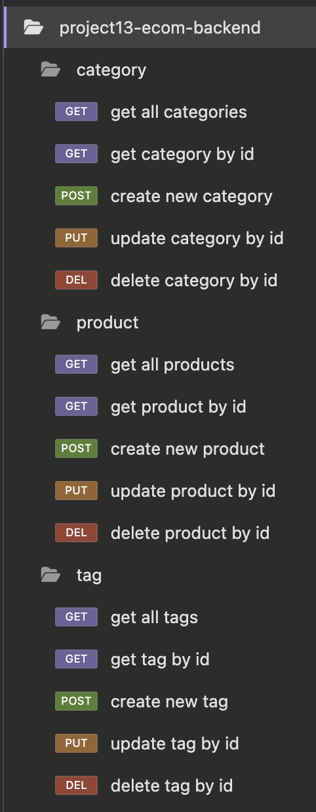

# E-Commerce Backend

## Description

The E-Commerce Backend is a comprehensive backend solution for managing an e-commerce platform. This API provides functionality to manage categories, products, tags, and their relationships. Built using Node.js, Express.js, Sequelize, and PostgreSQL, this project demonstrates a scalable, relational database architecture while offering robust RESTful API endpoints.



[View Demo Viedo](https://drive.google.com/file/d/your-demo-link/view?usp=sharing)

---

## Table of Contents

- [Description](#description)
- [How to Use](#how-to-use)
- [Example API Usage](#example-api-usage)
- [Technologies Used](#technologies-used)
- [Summary](#summary)

---

## How to Use

1. **Clone the Repository:**

   Clone the project to your local machine using:

   ```bash
   git clone https://github.com/YourUsername/ecommerce-backend.git
   ```

2. **Install Dependencies:**

   Navigate to the project directory and install the necessary dependencies:

   ```bash
   npm install
   ```

3. **Configure Environment Variables:**

   Create a `.env` file in the root directory and add your PostgreSQL credentials:

   ```env
   DB_NAME=ecommerce_db
   DB_USER=your_username
   DB_PASSWORD=your_password
   ```

4. **Create and Seed the Database:**

   Run the schema file to create the database and tables:

   ```bash
   psql -U your_username -d ecommerce_db -f db/schema.sql
   ```

   Seed the database with sample data:

   ```bash
   npm run seed
   ```

5. **Start the Server:**

   Start the API server:

   ```bash
   npm start
   ```

6. **API Testing:**

   Use a tool like **Insomnia** or **Postman** to test the API endpoints.

---

## Example API Usage

### **Category Routes**

- **GET /api/categories** - Retrieve all categories.
- **GET /api/categories/:id** - Retrieve a single category by ID.
- **POST /api/categories** - Create a new category.
  ```json
  {
    "category_name": "New Category"
  }
  ```
- **PUT /api/categories/:id** - Update a category by ID.
  ```json
  {
    "category_name": "Updated Category"
  }
  ```
- **DELETE /api/categories/:id** - Delete a category by ID.

### **Product Routes**

- **GET /api/products** - Retrieve all products.
- **GET /api/products/:id** - Retrieve a single product by ID.
- **POST /api/products** - Create a new product.
  ```json
  {
    "product_name": "New Product",
    "price": 29.99,
    "stock": 15,
    "category_id": 1
  }
  ```
- **PUT /api/products/:id** - Update a product by ID.
  ```json
  {
    "product_name": "Updated Product",
    "price": 19.99,
    "stock": 10
  }
  ```
- **DELETE /api/products/:id** - Delete a product by ID.

### **Tag Routes**

- **GET /api/tags** - Retrieve all tags.
- **GET /api/tags/:id** - Retrieve a single tag by ID.
- **POST /api/tags** - Create a new tag.
  ```json
  {
    "tag_name": "New Tag"
  }
  ```
- **PUT /api/tags/:id** - Update a tag by ID.
  ```json
  {
    "tag_name": "Updated Tag"
  }
  ```
- **DELETE /api/tags/:id** - Delete a tag by ID.

---

## Technologies Used

- **Node.js**: Runtime environment for building the server.
- **Express.js**: Framework for routing and middleware.
- **Sequelize**: ORM for PostgreSQL to manage relational database operations.
- **PostgreSQL**: Relational database for structured data storage.
- **dotenv**: For environment variable management.
- **Insomnia**: API testing and debugging tool.

---

## Summary

The E-Commerce Backend provides a robust and flexible solution for managing an online store's backend operations. With support for categories, products, tags, and their relationships, it serves as an efficient and scalable foundation for any e-commerce platform.
